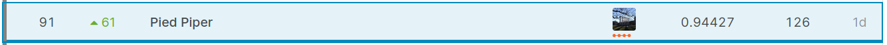

# Liverpool Ion Switching

This is the repository for the Kaggle competition: 

https://www.kaggle.com/c/liverpool-ion-switching/leaderboard

I got 89th out of 2618 teams (top 4%)

Key:

- Signal processing knowledge (remove 50Hz noise using STFT) 
- WaveNet (dilated CNN) & LSTM
- Modeling Hidden Markov property (HMM)
